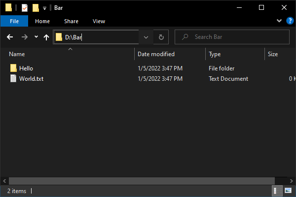
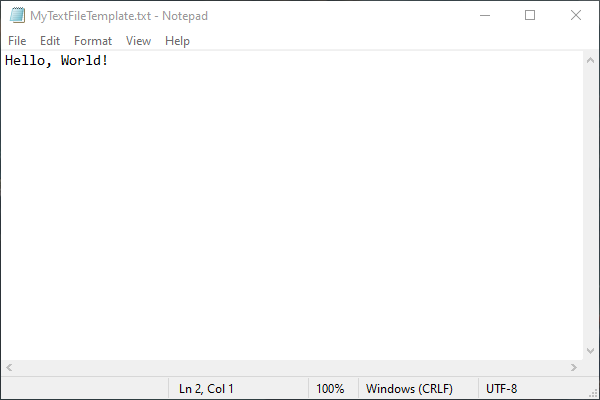

# Templata
An object-oriented and schematic ways of building and managing Windows files/directories using PowerShell.

# Current State
As of Jan. 5, 2022, this project is still in development with future release goal of late June 2022.

# Quick Preview

## PowerShell Input
```PowerShell
using module Templata
using namespace Templata

$template = [DirectoryTemplate]@{
    Name = 'Buzz'
    Children = @(
        [DirectoryTemplate]@{ Name = 'Foo' },
        [TextFileTemplate]@{ Name = 'Bar.txt' }
    )
    OnMounted = { 'Fizz' | Write-Host }
}

$model = [Model+Workbench]::new($template).BuildTo('D:\')
$model.FullName | Write-Host
```

## Console Output
```PowerShell
Fizz
D:\Buzz
```

## Disk Output


# More Previews

<details>
<summary>Extending from existing template</summary>

## PowerShell Input
```PowerShell
using module Templata
using namespace Templata
using namespace System.Collections

class MyTextFileTemplate : Template[FileModel] {
    MyTextFileTemplate([IDictionary]$details) : base($details) {}

    [Blueprint]ToBlueprint() {
        $inputText = $this.Details['Text']
        $wrappedText = "Hello, $inputText"
        return [TextFileTemplate]@{ Name = $this.Details['Name']; Text = $wrappedText }
    }
}

$path = 'D:\'

$template = [MyTextFileTemplate]@{
    Name = 'MyTextFileTemplate.txt'
    Text = 'World!'
}

$model = [Model+Workbench]::new($template).BuildTo($path)
```

## Disk Output


</details>
