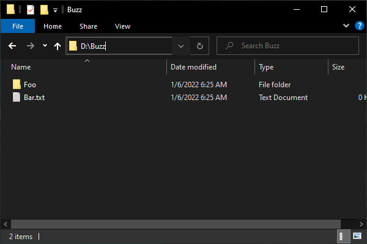

# Layoutize
An object-oriented and schematic way of building Windows file & directory structures using PowerShell.

# Current State
This project is currently in development.

# Quick Preview

## PowerShell Input
```PowerShell
using module Layoutize
using namespace Layoutize

$layout = [DirectoryLayout]@{
    Name = 'Buzz'
    Children = @(
        [DirectoryLayout]@{ Name = 'Foo' },
        [TextFileLayout]@{ Name = 'Bar.txt' }
    )
    OnMounted = { 'Fizz' | Write-Host }
}

$element = Mount-Element -Path 'D:\' -Layout $layout
$element | Write-Host
```

## Console Output
```PowerShell
Fizz
D:\Buzz
```

## Disk Output


# More Previews

<details>
<summary>Extending from existing template</summary>

## PowerShell Input
```PowerShell
using module Layoutize
using namespace Layoutize
using namespace Layoutize.Elements
using namespace System.Collections

class MyTextFileLayout : StatelessLayout {
    MyTextFileLayout([IEnumerable]$attributes) : base($attributes) {}

    [Layout]Build([IBuildContext]$context) {
        $inputText = $this.Attributes['Text']
        $wrappedText = "Hello, $inputText"
        return [TextFileLayout]@{ Name = $this.Attributes['Name']; Text = $wrappedText }
    }
}

$layout = [MyTextFileLayout]@{
    Name = 'MyTextFileLayout.txt'
    Text = 'World!'
}
$element = Mount-Element -Path 'D:\' -Layout $layout
```

## Disk Output


</details>
